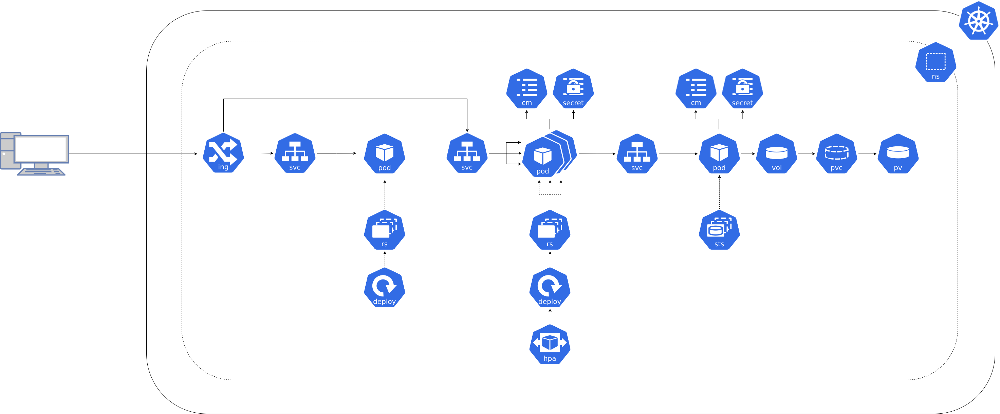

**Si besoin de revenir en arrière [⬅️](../README.md)**

## Contexte 📖

J'ai une super idée de produit à lancer ! La boutique pour toutes vos aventures ! Avec le nombre d'aventurier.e.s sur le salon, ça va faire fureur !  

J'ai développé mon application et préparé des images de conteneur pour les différents composants : `shop-frontend`, `shop-backend` et `shop-database`

Faut que je déploie ça vite et bien, on m'a dit de faire ça sur kubernetes, mais je n'y connais rien !

On m'a filé ce schéma, mais c'est de la magie noire 🔮 pour moi...



✂ Commençons par découper ça ✂


Ok j'y vois déjà un peu plus clair, mais il va falloir y aller petit à petit...

## Cheat sheet 📋

**Selection du contexte Kubernetes**
```shell 
kubectx <context>
```

**Créé ou configure les ressources décrites dans le fichier yaml**
```shell
kubectl apply -f <fichier.yml>
```

**Supprime les ressources décrites dans le fichier yaml**
```shell
kubectl delete -f <fichier.yml>
```

**Liste les objets Kubernetes**
```shell
kubectl get pods
kubectl get services
kubectl get deployments
```

**Affiche les logs d'un pod**
```shell
kubectl logs <pod-name>
```

## Pratique 👷

Récupérer son numéro de participant si pas déjà fourni par les speakers

Se connecter sur le cluster Kubernetes depuis [](https://gitpod.io/?autostart=true#https://gitlab.com/codelab-kubernetes/workshop)  

```shell
kubectx student-<numéro>
```

## Le premier `Pod`, c'est par là [➡️](../01-backend-pod/README.md)
