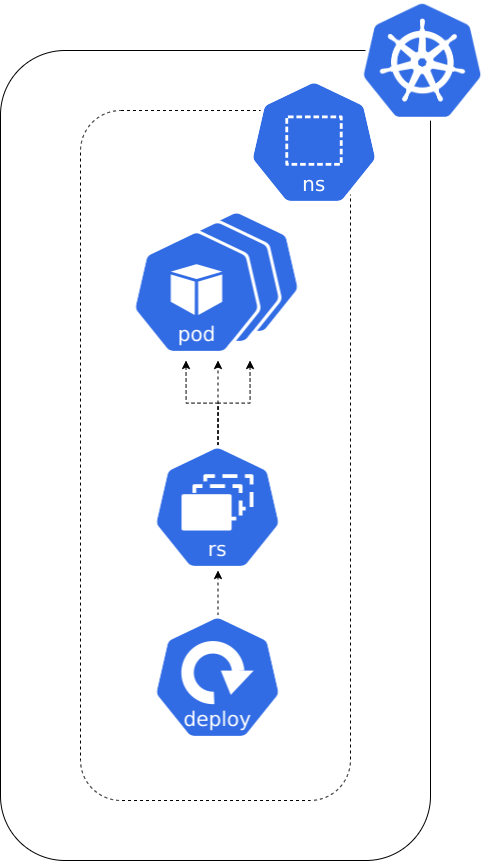
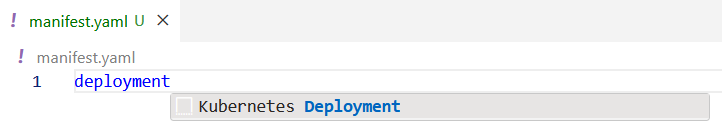
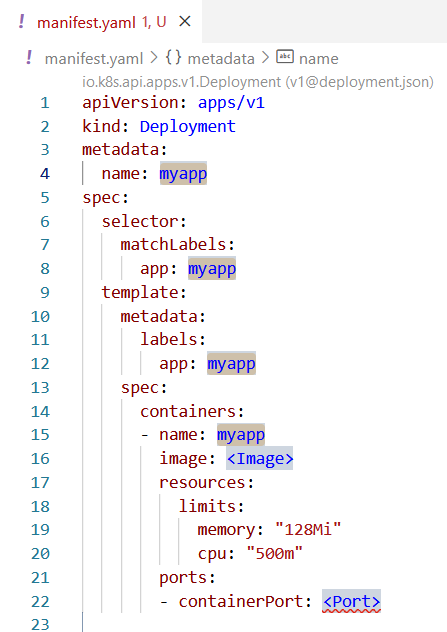

**Si besoin de revenir en arrière [⬅️](../01-backend-pod/README.md)**

## Contexte

Mon application va avoir beaucoup de succès ! J'en suis sûr ! Il faudrait que je puisse déployer plusieurs instances de mon backend pour gérer la charge.    
Je pourrai créer les `Pods` un par un, mais ça me semble fastidieux...  
Essayons d'utiliser un `Deployment` !  



## Concept

Un `Deployment` est un objet Kubernetes qui permet de gérer un ensemble de `Pods` cohérent entre eux.  
Il permet de définir le nombre de `Pods` à exécuter, de gérer le cycle de vie des `Pods` et de gérer la mise à jour des images de conteneur plus facilement.  
C'est l'objet de base pour déployer des applications sur Kubernetes. On n'utilise que très rarement le concept de `Pod` directement.  
Dans les faits, le `Deployment` va créer un `ReplicaSet` qui va lui-même créer les `Pods`.  

```yaml
apiVersion: apps/v1
kind: Deployment
metadata:
  name: appname-deployment
spec:
  replicas: 2
  selector:
    matchLabels:
      app: appname
  template:
    metadata:
      labels:
        app: appname
    spec:
      containers:
        - name: appname
          image: nginx:latest
          resources:
            requests:
              memory: "64Mi"
              cpu: "250m"
            limits:
              memory: "128Mi"
              cpu: "500m"
          ports:
            - containerPort: 80
```

La section `metadata` permet de définir le nom du `Deployment`.  

La section `spec` permet de définir les caractéristiques du `Deployment` :  
  * `replicas` : nombre de `Pods` à exécuter (par défaut 1)
  * `selector` : permet de définir quels `Pods` sont gérés par le `Deployment`
  * `template` : permet de définir le template des `Pods` créés par le `Deployment`, cette section est équivalente à une définition de `Pod`

## Cheat Sheet

Astuce : taper `Deployment` dans un fichier `.yaml` sur dans VS Code permet de récupérer un template.





## Pratique

1) Supprimez le `Pod` précédemment créé :  
```shell
kubectl delete pod/shop-backend  
```

2) Créez un fichier `deploy-backend.yaml` et créez un `Deployment` : 
    * dans votre `namespace` (ex: `student-XX`)  
    * nommé `shop-backend`  
    * déployant 3 `Pods`
    * identifiés par le label `app: shop-backend`
    * exécutant l'image `registry.gitlab.com/codelab-kubernetes/apps/shop-backend:no-database`  
    * allouant `32Mi` de mémoire et `50m` de CPU  
    * limitant la mémoire à `128Mi` et le CPU à `100m`  
    * exposant le port `8080`  


3) Déployer le `Deployment`  
```shell
kubectl apply -f deploy-backend.yaml
```

4) Vérifier le statut du `Deployment`
```shell
kubectl get deployments
```

5) Vérifier le statut des `Pods`
```shell
kubectl get pods
```

6) Vérifier les logs des `Pods` pilotés par le `Deployment`
```shell
kubectl logs deploy/shop-backend
```

## Et le frontend ? [➡️](../03-frontend-deployment/README.md)
