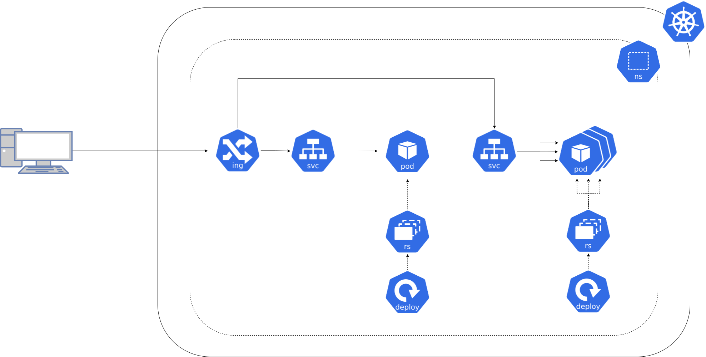
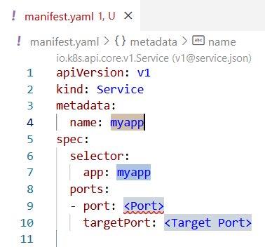
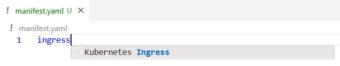
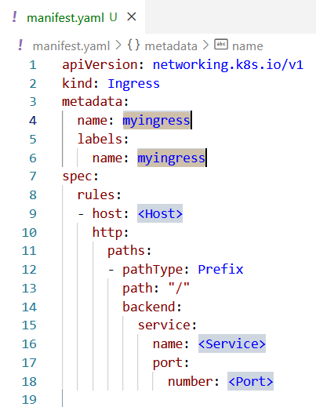

**Si besoin de revenir en arrière [⬅️](../03-frontend-deployment/README.md)**

## Contexte 📖

C'est bien ton histoire mais comment j'accède à mon appli ?  

On va voir comment exposer les composants en interne et en externe du cluster. avec les `Services` et les `Ingresses`.  



## Concepts 🎨

Un `Service` est un objet Kubernetes qui permet d'exposer un ensemble de `Pods` en interne du cluster.  
Il se base sur un selecteur de labels pour cibler l'ensemble de pods à exposer.  
Il permet de gérer la résolution de nom DNS, le load balancing entre les `Pods` et le port-forwarding.

```yaml
apiVersion: v1
kind: Service
metadata:
  name: appname
spec:
  type: ClusterIP
  selector:
    app: appname
  ports:
  - port: 8080
    targetPort: 8080
```

La section `metadata` permet de définir le nom du `Service`.  
La section `spec` permet de définir les caractéristiques du `Service` :  
  * `type` : type d'exposition du service  
    * `ClusterIP` : expose le `Service` en interne du cluster, c'est le type par défaut et le plus utilisé.  
    * `NodePort` : expose le `Service` sur un port fixe de chaque noeud du cluster, difficile à utiliser et maintenir.  
    * `LoadBalancer` : expose le `Service` sur un port fixe et provisionne un `LoadBalancer` externe, dépend de l'implémentation du cluster Kubernetes sous-jacent.  
    * `ExternalName` : permet de matérialiser une URL externe vers un `Service`.  
  * `selector` : permet de définir quels `Pods` sont gérés par le `Service`.  
  * `ports` : permet de définir les ports exposés par le `Service` et le port-forwarding entre les `Pods` et le `Service`.  
    * `port` : port du `Service`.  
    * `targetPort` : port du `Pod`.    

Un `Ingress` est un objet Kubernetes qui permet d'exposer un `Service` en externe du cluster.  
Il permet de choisir quelles URL sont exposées et de gérer le routage des requêtes vers les `Services` correspondants à l'instar d'un reverse proxy ou d'une VIP.  

```yaml
apiVersion: networking.k8s.io/v1
kind: Ingress
metadata:
  name: appname
  annotations:
    cert-manager.io/cluster-issuer: "letsencrypt-prod"
    nginx.ingress.kubernetes.io/ssl-redirect: "true"
spec:
  ingressClassName: nginx
  tls:
    - hosts:
        - appname.example.com
      secretName: tls
  rules:
    - host: appname.example.com
      http:
        paths:
          - path: /
            pathType: Prefix
            backend:
              service:
                name: appname
                port:
                  number: 8080
```

La section `metadata` permet de définir le nom de l'`Ingress`.  
La section `spec` permet de définir les caractéristiques de l'`Ingress` :  
  * `ingressClassName` : permet de définir la classe de l'`Ingress` (par défaut `nginx`).  
  * `tls` : permet de définir les configurations TLS de l'`Ingress`.  
    * `hosts` : permet de définir les noms de domaine à exposer.  
    * `secretName` : permet de définir le nom du `Secret` contenant les certificats TLS. Ce `Secret` est généré par le `cert-manager` grâce aux `annotations` présentes
  * `rules` : permet de définir une liste de règles de routage, une règle par `host`.  
    * `host` : permet de définir le nom de domaine à exposer.  
      * `http.paths[].path` : permet de définir le chemin d'accès concerné.  
      * `http.paths[].pathType` : permet de définir le type de chemin (`Prefix`, `Exact` ou `ImplementationSpecific`).    
      * `http.paths[].backend` : permet de définir le `Service` cible du routage. (nom et port)  

## Cheat Sheet 📋

* Astuce : taper `Service` dans un fichier `.yaml` sur dans VS Code permet de récupérer un template.




* Astuce : taper `Ingress` dans un fichier `.yaml` sur dans VS Code permet de récupérer un template.





* Astuce : il est possible de séparer plusieurs fragments de `yaml` dans un seul fichier en utilisant `---` comme séparateur.

## Pratique 👷

1) Créez un fichier `exposition.yaml` et créez un `Service` :  
    * nommé `shop-backend`  
    * ciblant les `Pods` identifiés par le label `app: shop-backend`  
    * exposant le port `8080` du `Pod` sur le port `8080` du `Service`


2) Dans le même fichier, créez un deuxième `Service` :  
    * nommé `shop-frontend`  
    * ciblant les `Pods` identifiés par le label `app: shop-frontend`  
    * exposant le port `80` du `Pod` sur le port `80` du `Service`


3) Dans le même fichier, créez un `Ingress` :  
    * nommé `shop-ingress`  
    * utilisant le `host` : \<student-X>.devshop.codelab.dwidwi.tech (remplacer `<student-X>` par votre identifiant de participant)
    * exposant en `https`
    * exposant le port `80` du `Service` nommé `shop-frontend` sur le chemin `/`  
    * exposant le port `8080` du `Service` nommé `shop-backend` sur le chemin `/api`  


4) Déployer les `Services` et l'`Ingress`
```shell
kubectl apply -f exposition.yaml
```

5) Vérifier le statut des `Services`
```shell
kubectl get svc
```

6) Vérifier le statut de l'`Ingress`
```shell
kubectl get ingress
```

7) Tester l'accès à l'application depuis un navigateur : `https://<student-X>.devshop.codelab.dwidwi.tech/` (remplacer `<student-X>` par votre identifiant de participant)  

## Les données sont bien statiques, on passe à la base de données ? [➡️](../05-database/README.md)
