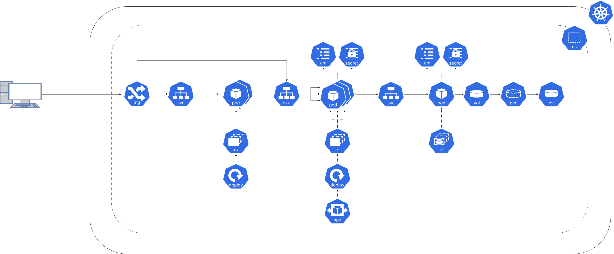
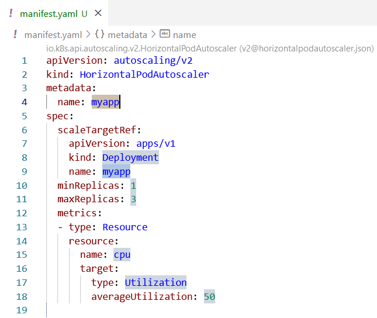

**Si besoin de revenir en arrière [⬅️](../05-database/README.md)**

## Contexte 📖

Avec Halloween qui arrive, mon appli va subir une charge de dingue !  

Il faudrait que je puisse ajouter des instances de mon backend automatiquement en fonction de la charge.  

Utilisons un `HorizontalPodAutoscaler` pour gérer ça !  



## Concept 🎨

Un `HorizontalPodAutoscaler` est un objet Kubernetes qui permet de gérer le nombre de `Pods` en fonction de l'usage de ressources (CPU ou mémoire) des `Pods`.  
Il permet de définir des règles de mise à l'échelle automatique pour faire varier le nombre de `Pods` entre un minimum et un maximum en fonction de la charge.  
Le cas d'usage le plus courant est de faire varier le nombre de `Pods` en fonction de l'usage CPU.  

```yaml
apiVersion: autoscaling/v2
kind: HorizontalPodAutoscaler
metadata:
  name: appname
spec:
  scaleTargetRef:
    apiVersion: apps/v1
    kind: Deployment
    name: appname
  minReplicas: 1
  maxReplicas: 3
  metrics:
  - type: Resource
    resource:
      name: cpu
      target:
        type: Utilization
        averageUtilization: 50
```

La section `metadata` permet de définir le nom du `HorizontalPodAutoscaler`.  
La section `spec` permet de définir les caractéristiques du `HorizontalPodAutoscaler` :  
  * `scaleTargetRef` : permet de définir la cible de mise à l'échelle automatique (ici un `Deployment`)
  * `minReplicas` : nombre minimum de `Pods`
  * `maxReplicas` : nombre maximum de `Pods`
  * `metrics` : permet de définir les métriques à utiliser pour la mise à l'échelle automatique

## Cheat Sheet 📋

Astuce : taper `HorizontalPodAutoscaler` dans un fichier `.yaml` sur dans VS Code permet de récupérer un template.




## Pratique 👷

1) Créez un fichier `hpa-backend.yaml` et créez un `HorizontalPodAutoscaler` : 
    * nommé `shop-backend`  
    * ciblant le `Deployment` `shop-backend`  
    * avec un minimum de 3 `Pod` et un maximum de 10 `Pods`  
    * utilisant l'usage CPU avec une moyenne d'utilisation de 50%

2) Appliquez le fichier `hpa-backend.yaml`
```shell
kubectl apply -f hpa-backend.yaml
```

3) Vérifiez que le `HorizontalPodAutoscaler` a bien été créé
```shell
kubectl get hpa
```

4) Pour simuler une charge, ouvrez un nouveau terminal et exécutez un `loader` sur le backend
```shell
kubectl run oha-loader -i --tty --rm --image=registry.gitlab.com/codelab-kubernetes/workshop:oha --restart=Never -- -z 60s -c 100 http://shop-backend:8080/api/products
```

5) Dans le premier terminal, vérifier que le nombre de `Pods` augmente 
```shell
kubectl get pods -w
```

6) Après un certain temps, vérifiez que le nombre de `Pods` diminue
```shell
kubectl get pods -w
```

## Ça marche vraiment bien tout ça, mais ça commence à faire beaucoup de fichiers à gérer...  [➡️](../07-helm/README.md)
